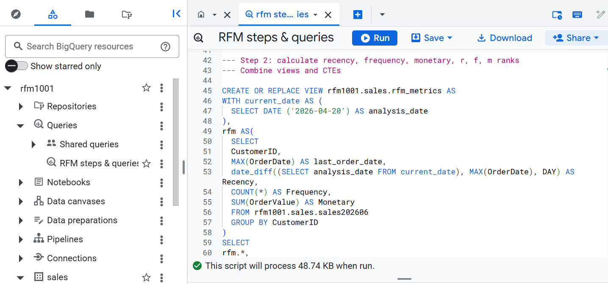
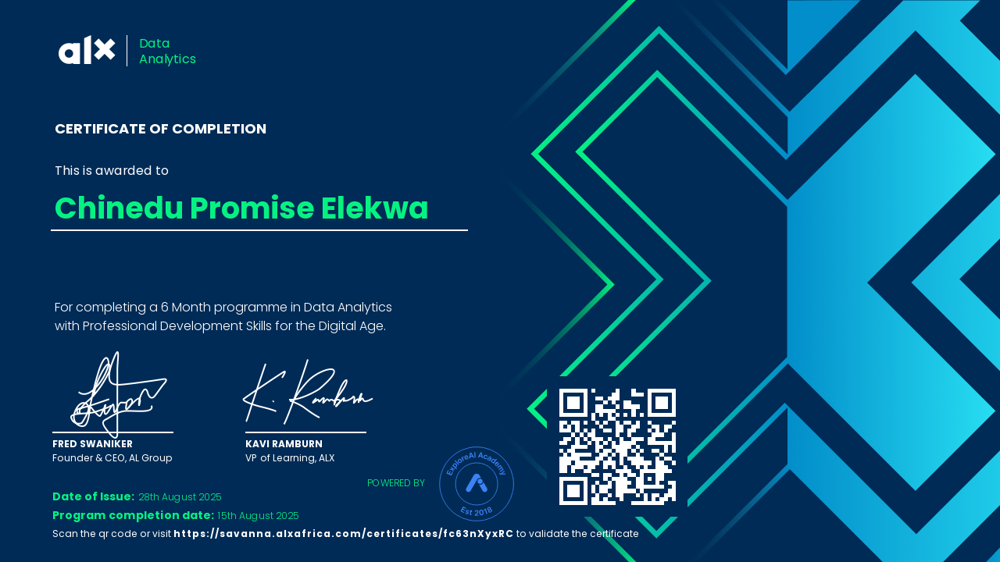

<html lang="en">
<head>
<meta charset="UTF-8" />
<meta name="viewport" content="width=device-width, initial-scale=1.0" />
<meta name="referrer" content="no-referrer" />

<link href="https://fonts.googleapis.com/css2?family=Syne:wght@400;500;600;700;800&family=IBM+Plex+Mono:wght@300;400;500&family=Inter:wght@300;400;500;600&display=swap" rel="stylesheet" />

</head>
<body>

<button class="theme-toggle" id="themeToggle" aria-label="Toggle theme">
  

  Light Mode
</button>

<!-- ① Emoji on logo  ② CV link after logo  ③ "Let's Connect" CTA -->
<nav>
  <a href="#" class="nav-logo">
    

    👋 Hello, Welcome
  </a>
  <ul class="nav-links">
    <li><a href="#skills">Skills</a></li>
    <li><a href="#projects">Projects</a></li>
    <li><a href="#experience">Experience</a></li>
    <li><a href="#certifications">Certs</a></li>
    <li><a href="#recognitions">Recognition</a></li>
    <li>
      <a href="https://drive.google.com/file/d/1IFWvI5BjqUNMbXyBTHfTBnDJVfLt5us7/view?usp=sharing"
         target="_blank" class="nav-cv">
        <svg width="12" height="12" viewBox="0 0 24 24" fill="none" stroke="currentColor" stroke-width="2"
             stroke-linecap="round" stroke-linejoin="round">
          <path d="M14 2H6a2 2 0 00-2 2v16a2 2 0 002 2h12a2 2 0 002-2V8z"/>
          <polyline points="14 2 14 8 20 8"/>
          <line x1="12" y1="18" x2="12" y2="12"/>
          <line x1="9" y1="15" x2="15" y2="15"/>
        </svg>
        My CV
      </a>
    </li>
    <li><a href="#contact" class="nav-cta">Let's Connect</a></li>
  </ul>
  

</nav>

  <button class="mobile-nav-close" id="mobileNavClose">&#10005;</button>
  <a href="#skills" class="mobile-nav-link">Skills</a>
  <a href="#projects" class="mobile-nav-link">Projects</a>
  <a href="#experience" class="mobile-nav-link">Experience</a>
  <a href="#certifications" class="mobile-nav-link">Certifications</a>
  <a href="#recognitions" class="mobile-nav-link">Recognition</a>
  <a href="https://drive.google.com/file/d/1IFWvI5BjqUNMbXyBTHfTBnDJVfLt5us7/view?usp=sharing"
     target="_blank" class="mobile-nav-link">Download CV</a>
  <a href="#contact" class="mobile-nav-link" style="color:var(--accent)">Let's Connect</a>

<!-- HERO -->
<section class="hero" id="hero">
  

  

  

  

    

      

        

        

        

        
        
Photo

        
Open to Work

      

    

    

      
Lagos, Nigeria

      <!-- ④ Name redesign: "I'm" intro + CHINEDU large + ELEKWA PROMISE shimmer, both slightly reduced -->
      <h1 class="hero-name">
        <em class="wave">👋</em> I'm
        CHINEDU
        ELEKWA PROMISE
        
      </h1>

      

        Data Analyst
        Business Intelligence
      

      
Building scalable data solutions and turning raw data into strategic insights. I bring the precision of a mathematician, the clarity of an educator, and the impact-focus of a business analyst to every problem I solve.

      

        <a href="#projects" class="btn-primary">Explore My Work &#8594;</a>
        <a href="#contact" class="btn-secondary">Let's Connect &#8599;</a>
      

      

        
0Years in Data

        
0Analytics Efficiency

        
0Certifications

        
0Analysts Mentored

      

    

  

</section>

<!-- EXPERTISE -->
<section id="expertise">
  
Core Strengths

  <h2 class="section-title">My Technical Expertise</h2>
  
Specialized capabilities that define my impact across data, analytics, and business intelligence.

  

    

      Statistical Analytics
      Professional Dashboard Design
      Digital Marketing Analytics
      FMCG Analytics
      Data Modeling
      Executive-style PowerPoint Reports
      Advanced Data Analytics &amp; Visualisation with Python
      Statistical Analytics
      Professional Dashboard Design
      Digital Marketing Analytics
      FMCG Analytics
      Data Modeling
      Executive-style PowerPoint Reports
      Advanced Data Analytics &amp; Visualisation with Python
    

  

</section>

<!-- SKILLS -->
<section id="skills">
  
Technical Arsenal

  <h2 class="section-title">What I Work With</h2>
  
From spreadsheets to cloud — every layer of the data workflow.

  

    

      
&#x2B21;Languages &amp; Querying

      
SQLPython

    

    

      
&#9678;Visualization &amp; BI

      
Power BILooker StudioMS PowerPoint

    

    

      
&#9635;Spreadsheets &amp; Productivity

      
MS ExcelGoogle SheetsPower QueryGoogle FormsGoogle Workspace

    

    

      
&#9672;ERP &amp; Operations

      
SAP

    

    

      
&#9711;Cloud &amp; Platforms

      
Google CloudBigQuery

    

    

      
&#9643;Soft Skills &amp; Leadership

      
Data MentorshipReport WritingStakeholder CommsTeachingGrowth Mindset

    

  

</section>

<!-- PROJECTS -->
<section id="projects">
  
Selected Work

  <h2 class="section-title">Projects</h2>
  
Real analytics work across FMCG, education, and edtech.

  

    

      

      
[ FMCG Production Analytics ]

      

        
01Case Study

        
FMCG Production Analytics System

        
<strong style="color:var(--text-primary)">Problem:</strong> No visibility into production inefficiencies.  <strong style="color:var(--text-primary)">Approach:</strong> Built a Google Forms + Sheets pipeline tracking output, downtime, and waste.  <strong style="color:var(--text-primary)">Impact:</strong> Analytics efficiency lifted to 95% &#8212; enabling faster operational decisions.

        
Google SheetsSAPReporting

      

    

    

  

  

  

  

    [ RFM ANALYSIS (Using SQL and PowerBi) ]
  

  

    

      02
      Business Intelligence
    

    
Recency Frequency Monetary (RFM) ANALYSIS

    

      This project is a comprehensive RFM (Recency, Frequency, Monetary) Customer Segmentation Analysis implemented in BigQuery. It transforms raw monthly transactional data into actionable marketing segments to help a business identify its most valuable customers and those at risk of churning.
    

    

      Google Big Query
      SQL
      Window Functions
      PowerBi
    

    <a href="https://github.com/Nedupelekwa/RFM-ANALYSIS" target="_blank" class="project-link">
      View on GitHub &#8599;
    </a>
  

    
    

      

      
      
[ Power BI Business Dashboard ]

      

        
02Business Intelligence

        
Power BI Business Dashboard

        
End-to-end sales analytics dashboard revealing key business trends. Key finding: +24.5% YoY Sales growth from 2021&#8211;2022, enabling strategic leadership decisions.

        
Power BIDAXPower QueryMS Excel

        <a href="https://github.com/Nedupelekwa/POWERBI-BUSINESS-DASHBOARD" target="_blank" class="project-link">View on GitHub &#8599;</a>
      

    

    
    

      

      
      

        
03Marketing Analytics

        
Marketing Call Dashboard

        
Developed a comprehensive data tracking system and dashboard to monitor the efficiency of marketing call campaigns across multiple program verticals. This project manages and analyzes a dataset of over 14,000 records to identify conversion trends, communication barriers, and program-specific performance

        
Dynamic filtersGoogle Sheets DashboardData Reporting

        <a href="https://github.com/Nedupelekwa/Marketing-Call-dashboard" target="_blank" class="project-link">View Portfolio &#8599;</a>
      

    

<!-- EXPERIENCE -->
<section id="experience">
  
Career History

  <h2 class="section-title">Experience</h2>
  
Where I've built things that matter.

  

    

      

      
    

      

      
Sept 2024 &#8212; Feb 2026

      
Production Data Analyst

      
Frutta Juice and Services Limited &middot; Lagos, Nigeria

      <ul class="timeline-bullets">
        <li>Built a Google Forms &amp; Sheets pipeline tracking output, downtime, waste and material usage &#8212; increasing analytics efficiency to 95%</li>
        <li>Managed production inventory end-to-end on SAP from raw materials to warehouse transfer</li>
        <li>Developed production and material plans to ensure continuous operations</li>
        <li>Produced professional stakeholder production reports using PowerPoint</li>
      </ul>
    

    
Sept 2025 &#8212; Present

      
Data Analyst Intern

      
edMotion Technologies &middot; Remote

      <ul class="timeline-bullets">
        <li>Working on data analytics projects in the edtech space, applying SQL and spreadsheet skills to derive insights</li>
        <li>Contributing to data-driven product decisions and reporting workflows</li>
      </ul>
    

    

      

      
Sept 2025 — Present

      
DATA Volunteer Mentor

      
ALX Africa Data Programs · Remote

      <ul class="timeline-bullets">
        <li>Mentoring aspiring data professionals across Africa in analytics, Python, and data science</li>
      </ul>
    

    
    

      

      
Jan 2023 &#8212; Sept 2024

      
Mathematics Educator / Data Analyst

      
Cedec International Secondary School &middot; Lagos, Nigeria

      <ul class="timeline-bullets">
        <li>Built and maintained a student performance database; analysed results with Excel to track progress</li>
        <li>Produced data-backed performance reports for school leadership and parents</li>
        <li>Managed customer relationships and provided mentorship to students</li>
      </ul>
    

    

      

      
2020 &#8212; 2021 &middot; 2013 &#8212; 2014

      
Mathematics Educator

      
Great Divine College &amp; Divine Victory Schools &middot; Lagos, Nigeria

      <ul class="timeline-bullets">
        <li>Taught Mathematics at secondary school level &#8212; building the analytical foundations that underpin my data career</li>
      </ul>
    

  

</section>

<!-- CERTIFICATIONS -->
<section id="certifications">
  
Credentials

  <h2 class="section-title">Certifications and Certificates</h2>
  
Verified expertise across cloud, analytics, and data science.

  
Career Certifications

  

    

&#9729;Certificate Preview

View Certificate &#8599;

Google Cloud Data Analyst Certificate

Google Cloud
<a href="https://www.credly.com/badges/8978d604-f416-4365-bfc5-9bc49dc80c8a/public_url" target="_blank" class="cert-view-link green-link">View Certificate &#8599;</a>

    

&#9672;Certificate Preview

View Certificate &#8599;

ALX Data Science

ALX Africa
<a href="https://drive.google.com/file/d/1adgB-IFRJ86S7Y9c0JUY3HwL3YGZ3pPl/view?usp=drive_link" target="_blank" class="cert-view-link green-link">View Certificate &#8599;</a>

    

&#9678;Certificate Preview

View Certificate &#8599;

Associate Data Analyst Certificate

DataCamp
<a href="https://www.datacamp.com/tracks/associate-data-analyst-in-sql?utm_medium=organic_social&utm_campaign=sharewidget&utm_content=trackdetailpage&utm_source=copy" target="_blank" class="cert-view-link green-link">View Certificate &#8599;</a>

    

&#9711;Certificate Preview

View Certificate &#8599;

ALX Data Analytics

ALX Africa
<a href="https://drive.google.com/file/d/1mIyLDO280vdvNAHHmWQPQPjv8I8J5PaA/view?usp=drive_link" target="_blank" class="cert-view-link green-link">View Certificate &#8599;</a>

    

&#9711;Certificate Preview

View Certificate &#8599;

ALX Python Programming

ALX Africa
<a href="https://drive.google.com/file/d/1CGBWo5SJWcrD5WL2-5crNmJzcVIs1qVi/view?usp=drive_link" target="_blank" class="cert-view-link green-link">View Certificate &#8599;</a>

    

&#9711;Certificate Preview

View Certificate &#8599;

Microsoft Business Analyst Professional Certificate

Microsoft via Coursera
<a href="https://coursera.org/share/c6567e811cee90cb8fc4cfa63c8aad9c" target="_blank" class="cert-view-link green-link">View Certificate &#8599;</a>

    

&#9711;Certificate Preview

View Certificate &#8599;

SQL for Business Analysts

DataCamp
<a href="https://www.datacamp.com/completed/statement-of-accomplishment/track/750b783b48ed45a69debb82aa1741067210f145f" target="_blank" class="cert-view-link green-link">View Certificate &#8599;</a>

    

&#9635;Certificate Preview

View Certificate &#8599;

Google Workspace &#8212; Calendar, Drive, Docs, Sheets, Slides

Google via Coursera
<a href="https://drive.google.com/drive/folders/1y6hDZvx9gvkXm_SD9oOWFSPB0vtAkHSb?usp=drive_link" target="_blank" class="cert-view-link green-link">View Certificate &#8599;</a>

  

  
Professional &amp; Soft Skills

  

    

&#9643;Certificate Preview

View Certificate &#8599;

ALX Professional Foundations

ALX Africa
<a href="https://drive.google.com/file/d/1EulTVxF5SmHwMA63BCH7gDclpdnMFohp/view?usp=drive_link" target="_blank" class="cert-view-link">View Certificate &#8599;</a>

    

&#x2B21;Certificate Preview

View Certificate &#8599;

Jobberman Soft Skills Training

Jobberman &middot; 2021
<a href="https://drive.google.com/file/d/17Y-4ZJxH1PjtGGZVE4GO0IZ8D9zmm6sC/view?usp=drive_link" target="_blank" class="cert-view-link">View Certificate &#8599;</a>

    

&#x2B21;Certificate Preview

View Certificate &#8599;

Data Literacy Certificate

DataCamp
<a href="https://www.datacamp.com/skill-verification/DL0034034405845" target="_blank" class="cert-view-link">View Certificate &#8599;</a>

  

</section>

<!-- RECOGNITIONS -->
<section id="recognitions" style="background:var(--bg-card);border-top:1px solid var(--border);border-bottom:1px solid var(--border)">
  
Recognition

  <h2 class="section-title">Awards &amp; Volunteer Service</h2>
  

    

&#127757;

View Recognition &#8599;

Certificate of Completed Service &#8212; NYSC

Completed the one year compulsory national service for Nigerian graduates
<a href="https://drive.google.com/file/d/11CL2qk2E5tD2hEfotGluMjqMLXON8gKs/view?usp=drive_link" target="_blank" class="rec-view-link">View Recognition &#8599;</a>

    

&#127757;

View Recognition &#8599;

DATA Volunteer Mentor &#8212; ALX Africa

Supporting the next generation of data professionals across Africa through hands-on mentorship in analytics, Python programming, and data science since September 2025.
<a href="https://tinyurl.com/bdhbn9zt" target="_blank" class="rec-view-link">View Recognition &#8599;</a>

    

&#127897;

View Recognition &#8599;

GDAI 2025 Session Moderator

Recognised by DataGlobal Hub with a Certificate of Recognition for Volunteer Service as Session Moderator at the Virtual Global Data &amp; AI Tech Conference (GDAI) 2025.
<a href="https://drive.google.com/file/d/10qfqjgp9Gb0IXXtZyjED8898NETCoEry/view?usp=drive_link" target="_blank" class="rec-view-link">View Recognition &#8599;</a>

    

&#9672;

View Recognition &#8599;

Ambassador &#8212; DataGlobal Hub

Appointed as Ambassador at DataGlobal Hub, representing and advocating for the growth of the data and AI community in Nigeria and across Africa.
<a href="https://drive.google.com/file/d/16gvU8oEHC-lnasKTStIUVshoT37Y4UO0/view?usp=sharing" target="_blank" class="rec-view-link">View Recognition &#8599;</a>

  

</section>

<!-- WHY HIRE ME -->
<section id="recruiter" style="background:var(--bg-card);border-top:1px solid var(--border);border-bottom:1px solid var(--border)">
  
Why Hire Me

  <h2 class="section-title">I Don&#8217;t Just Analyze Data &#8212; I Drive Decisions</h2>
  

    

&#128202; Business-First Analyst

I translate raw data into decisions executives can act on immediately &#8212; not just charts, but clear, actionable intelligence.

    

&#9881;&#65039; End-to-End Problem Solver

From data collection &#8594; cleaning &#8594; modeling &#8594; visualization &#8594; insight delivery. I own the full pipeline.

    

&#128640; Impact-Oriented Work

Every project is tied to measurable business improvement or operational efficiency &#8212; 95% analytics uplift as proof.

  

</section>

<!-- CONTACT -->
<section id="contact">
  

    
Let&#8217;s Talk

    <h2 class="section-title reveal">Open to the Right Opportunity</h2>
    
Whether it&#8217;s a full-time role, a freelance project, or just a conversation about data &#8212; I&#8217;d love to hear from you.

    <a href="mailto:chinedupelekwa@gmail.com" class="contact-email reveal">
      &#9993;
      Send Me a Mail
    </a>
    

      <a href="https://www.linkedin.com/in/chinedu-elekwa/" target="_blank" class="social-link">
        <svg width="14" height="14" viewBox="0 0 24 24" fill="currentColor" xmlns="http://www.w3.org/2000/svg" style="flex-shrink:0"><path d="M20.447 20.452h-3.554v-5.569c0-1.328-.027-3.037-1.852-3.037-1.853 0-2.136 1.445-2.136 2.939v5.667H9.351V9h3.414v1.561h.046c.477-.9 1.637-1.85 3.37-1.85 3.601 0 4.267 2.37 4.267 5.455v6.286zM5.337 7.433c-1.144 0-2.063-.926-2.063-2.065 0-1.138.92-2.063 2.063-2.063 1.14 0 2.064.925 2.064 2.063 0 1.139-.925 2.065-2.064 2.065zm1.782 13.019H3.555V9h3.564v11.452zM22.225 0H1.771C.792 0 0 .774 0 1.729v20.542C0 23.227.792 24 1.771 24h20.451C23.2 24 24 23.227 24 22.271V1.729C24 .774 23.2 0 22.222 0h.003z"/></svg>
        LinkedIn
      </a>
      <a href="https://tinyurl.com/bdhbn9zt" target="_blank" class="social-link">
        <svg width="14" height="14" viewBox="0 0 24 24" fill="none" stroke="currentColor" stroke-width="2" stroke-linecap="round" stroke-linejoin="round" style="flex-shrink:0"><circle cx="12" cy="12" r="10"/><path d="M8 12l3 3 5-5"/></svg>
        View My Credentials
      </a>
      <a href="https://drive.google.com/file/d/1IFWvI5BjqUNMbXyBTHfTBnDJVfLt5us7/view?usp=sharing" target="_blank" class="social-link">
        <svg width="14" height="14" viewBox="0 0 24 24" fill="none" stroke="currentColor" stroke-width="2" stroke-linecap="round" stroke-linejoin="round" style="flex-shrink:0"><path d="M14 2H6a2 2 0 00-2 2v16a2 2 0 002 2h12a2 2 0 002-2V8z"/><polyline points="14 2 14 8 20 8"/><line x1="12" y1="18" x2="12" y2="12"/><line x1="9" y1="15" x2="15" y2="15"/></svg>
        Download My CV
      </a>
      <a href="tel:+2347033130747" class="social-link">
        <svg width="14" height="14" viewBox="0 0 24 24" fill="none" stroke="currentColor" stroke-width="2" stroke-linecap="round" stroke-linejoin="round" style="flex-shrink:0"><path d="M22 16.92v3a2 2 0 01-2.18 2 19.79 19.79 0 01-8.63-3.07A19.5 19.5 0 013.07 9.81a19.79 19.79 0 01-3.07-8.67A2 2 0 012 1h3a2 2 0 012 1.72 12.84 12.84 0 00.7 2.81 2 2 0 01-.45 2.11L6.91 8.9a16 16 0 006.19 6.19l1.27-1.27a2 2 0 012.11-.45 12.84 12.84 0 002.81.7A2 2 0 0122 16.92z"/></svg>
        Call Me
      </a>
    

  

</section>

<footer>
  
&#169; 2026 Chinedu Elekwa Promise. All rights reserved.

  
Built like a Data Product &middot; Lagos, Nigeria

</footer>

  <a href="#projects" class="secondary">View Work</a>
  <a href="#contact" class="primary">Let's Connect &#8594;</a>

</body>
</html>
