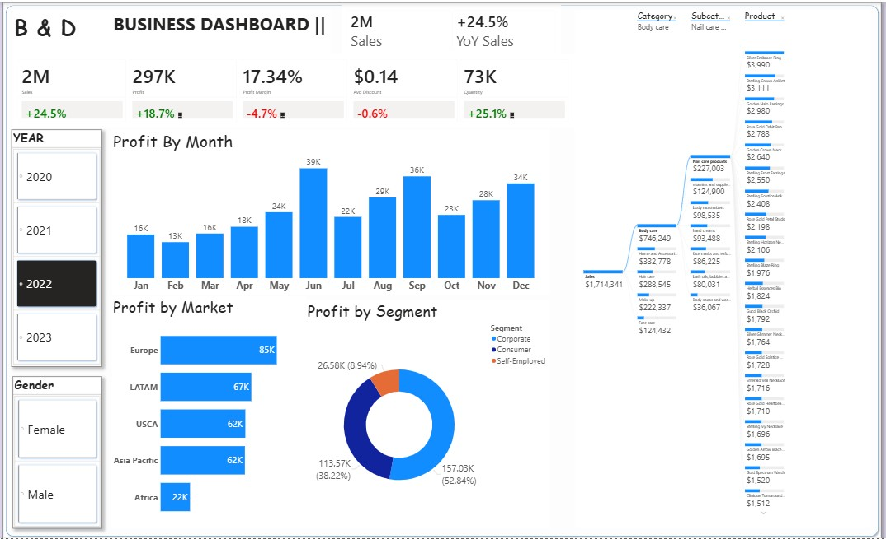

<!DOCTYPE html>
<html lang="en">
<head>
<meta charset="UTF-8" />
<meta name="viewport" content="width=device-width, initial-scale=1.0" />
<title>Chinedu Elekwa Promise | Data Analyst</title>
<meta name="referrer" content="no-referrer" />

<link href="https://fonts.googleapis.com/css2?family=Syne:wght@400;500;600;700;800&family=IBM+Plex+Mono:wght@300;400;500&family=Inter:wght@300;400;500;600&display=swap" rel="stylesheet" />

</head>
<body>

<!-- NAV -->
<nav>
  <a href="#" class="nav-logo">[ chinedu.elekwa ]</a>
  <ul class="nav-links">
    <li><a href="#skills">Skills</a></li>
    <li><a href="#projects">Projects</a></li>
    <li><a href="#experience">Experience</a></li>
    <li><a href="#certifications">Certs</a></li>
    <li><a href="#recognitions">Recognition</a></li>
    <li><a href="#contact" class="nav-cta">Hire Me</a></li>
  </ul>
  

    
  

</nav>

<!-- MOBILE NAV OVERLAY -->

  <button class="mobile-nav-close" onclick="document.querySelector('.mobile-nav').classList.remove('open')">✕</button>
  <a href="#skills" onclick="document.querySelector('.mobile-nav').classList.remove('open')">Skills</a>
  <a href="#projects" onclick="document.querySelector('.mobile-nav').classList.remove('open')">Projects</a>
  <a href="#experience" onclick="document.querySelector('.mobile-nav').classList.remove('open')">Experience</a>
  <a href="#certifications" onclick="document.querySelector('.mobile-nav').classList.remove('open')">Certifications</a>
  <a href="#recognitions" onclick="document.querySelector('.mobile-nav').classList.remove('open')">Recognition</a>
  <a href="#contact" onclick="document.querySelector('.mobile-nav').classList.remove('open')" style="color:var(--accent)">Hire Me</a>

<!-- HERO -->
<section class="hero" id="hero">
  

  

  

  

    <!-- TEXT -->
    

      <h1 class="hero-name">Chinedu Elekwa</h1>
      
Open to new opportunities · Lagos, Nigeria

      
Data Analyst & Aspiring Analytics Engineer

      

        Building scalable data solutions and turning raw data into strategic insights. I bring the precision of a mathematician, the clarity of an educator, and the impact-focus of a business analyst to every problem I solve.
      

      

        SQL
        Python
        Power BI
        Looker Studio
        Data Modeling
        SAP
        MS PowerPoint
      

      

        <a href="#projects" class="btn-primary">Explore My Work →</a>
        <a href="#contact" class="btn-secondary">Get in touch ↗</a>
      

      

        
5+Years in Data

        
95%Analytics Efficiency

        
4+Certifications

        
100+Analysts Mentored

      

    

    <!-- PHOTO -->
    

      

        

        
      

    

  

</section>

<!-- SKILLS -->
<section id="skills">
  
Technical Arsenal

  <h2 class="section-title">What I Work With</h2>
  
From spreadsheets to cloud — every layer of the data workflow.

  

    

      
⬡

      
Languages & Querying

      

        SQLPython
        Data CleaningStatistical AnalysisMathematics
      

    

    

      
◎

      
Visualization & BI

      

        Power BILooker Studio
        DAXDashboard DesignMS PowerPoint
      

    

    

      
▣

      
Spreadsheets & Productivity

      

        MS ExcelGoogle Sheets
        Google FormsGoogle Workspace
      

    

    

      
◈

      
ERP & Operations

      

        SAP
        Production PlanningInventory ManagementFMCG Supply Chain
      

    

    

      
◯

      
Cloud & Platforms

      

        Google Cloud
        BigQueryLooker StudioGoogle Drive
      

    

    

      
◫

      
Soft Skills & Leadership

      

        Data MentorshipReport Writing
        Stakeholder CommsTeachingGrowth Mindset
      

    

  

</section>

<!-- PROJECTS -->
<section id="projects">
  
Selected Work

  <h2 class="section-title">Projects</h2>
  
Real analytics work across FMCG, education, and edtech.

  

    

      
[ FMCG Production Analytics ]

      

        
01Production Analytics

        
FMCG Production Data Pipeline

        
Designed and deployed a data collection and analytics system at Frutta Juice & Services Ltd tracking output, downtime, waste, and material usage — boosting analytics efficiency to 95%.

        

          Google SheetsGoogle Forms
          SAPMS PowerPoint
        

        <a href="https://nedupelekwa.github.io" target="_blank" class="project-link">View Portfolio ↗</a>
      

    

    

      
      
[ Power BI Business Dashboard ]

      

        
02Business Intelligence

        
Power BI Business Dashboard

        
End-to-end sales analytics dashboard revealing key business trends. Key finding: +24.5% YoY Sales growth from 2021 to 2022, enabling strategic leadership decisions.

        

          Power BIDAX
          Power QueryMS Excel
        

        <a href="https://github.com/Nedupelekwa/POWERBI-BUSINESS-DASHBOARD" target="_blank" class="project-link">View on GitHub ↗</a>
      

    

    

      
[ Student Performance Analysis ]

      

        
03Education Analytics

        
Student Performance Analysis System

        
Built and maintained a student performance database. Used Excel to analyse results, identify at-risk students, and produce data-backed reports for school leadership and parents.

        

          MS Excel
          Google SheetsData Reporting
        

        <a href="https://nedupelekwa.github.io" target="_blank" class="project-link">View Portfolio ↗</a>
      

    

  

</section>

<!-- EXPERIENCE -->
<section id="experience" style="background: var(--bg-card); border-top: 1px solid var(--border); border-bottom: 1px solid var(--border);">
  
Career History

  <h2 class="section-title">Experience</h2>
  
Where I've built things that matter.

  

    

      

      
Sept 2025 — Present

      
Data Analyst Intern

      
edMotion Technologies · Remote

      <ul class="timeline-bullets">
        <li>Working on data analytics projects in the edtech space, applying SQL and Python to derive insights</li>
        <li>Contributing to data-driven product decisions and reporting workflows</li>
      </ul>
    

    

      

      
Sept 2025 — Present

      
DATA Volunteer Mentor

      
ALX Africa Data Programs · Remote

      <ul class="timeline-bullets">
        <li>Mentoring aspiring data professionals across Africa in analytics, Python, and data science</li>
        <li>Served as Session Moderator at the Virtual Global Data & AI Tech Conference (GDAI) 2025</li>
        <li>Recognised as Ambassador by DataGlobal Hub for contributions to the data community</li>
      </ul>
    

    

      

      
2023 — 2025

      
Production Planner / Production Data Analyst

      
Frutta Juice and Services Limited · Lagos, Nigeria

      <ul class="timeline-bullets">
        <li>Built a Google Forms & Sheets pipeline tracking output, downtime, waste and material usage — increasing analytics efficiency to 95%</li>
        <li>Managed production inventory end-to-end on SAP from raw materials to warehouse transfer</li>
        <li>Developed production and material plans to ensure continuous operations</li>
        <li>Produced professional stakeholder production reports using PowerPoint</li>
      </ul>
    

    

      

      
Jan 2023 — Sept 2024

      
Mathematics Educator / Data Analyst

      
Cedec International Secondary School · Lagos, Nigeria

      <ul class="timeline-bullets">
        <li>Built and maintained a student performance database; analysed results with Excel to track progress</li>
        <li>Produced data-backed performance reports for school leadership and parents</li>
        <li>Managed customer relationships and provided mentorship to students</li>
      </ul>
    

    

      

      
2020 — 2021 · 2013 — 2014

      
Mathematics Educator

      
Great Divine College & Divine Victory Schools · Lagos, Nigeria

      <ul class="timeline-bullets">
        <li>Taught Mathematics at secondary school level — building the analytical foundations that underpin my data career</li>
      </ul>
    

  

</section>

<!-- CERTIFICATIONS -->
<section id="certifications">
  
Credentials

  <h2 class="section-title">Certifications</h2>
  
Verified expertise across cloud, analytics, and data science.

  
Career Certifications

  

    

☁

Google Cloud Data Analyst Certificate

Google Cloud

    

◈

Data Analytics, Python Programming & Data Science

ALX Africa

    

◎

Associate Data Analyst Certificate

DataCamp

    

◯

Data Literacy Certificate

DataCamp

    

▣

Google Workspace — Calendar, Drive, Docs, Sheets, Slides

Google via Coursera

  

  
Professional & Soft Skills

  

    

◫

ALX Professional Foundations

ALX Africa

    

⬡

Jobberman Soft Skills Training

Jobberman · 2021

  

</section>

<!-- RECOGNITIONS -->
<section id="recognitions" style="background: var(--bg-card); border-top: 1px solid var(--border); border-bottom: 1px solid var(--border);">
  
Recognition

  <h2 class="section-title">Awards & Volunteer Service</h2>
  
Giving back to the African data community.

  

    

      
🌍

      
DATA Volunteer Mentor — ALX Africa

      
Supporting the next generation of data professionals across Africa through hands-on mentorship in analytics, Python programming, and data science since September 2025.

    

    

      
🎙

      
GDAI 2025 Session Moderator

      
Recognised by DataGlobal Hub with a Certificate of Recognition for Volunteer Service as Session Moderator at the Virtual Global Data & AI Tech Conference (GDAI) 2025.

    

    

      
◈

      
Ambassador — DataGlobal Hub

      
Appointed as Ambassador at DataGlobal Hub, representing and advocating for the growth of the data and AI community in Nigeria and across Africa.

    

  

</section>

<!-- CONTACT -->
<section id="contact">
  

    
Let's Talk

    <h2 class="section-title reveal">Open to the Right Opportunity</h2>
    

      Whether it's a full-time role, a freelance project, or just a conversation about data — reach out.
    

    <a href="mailto:chinedupelekwa@gmail.com" class="contact-email reveal">chinedupelekwa@gmail.com</a>
    

      <a href="https://www.linkedin.com/in/chinedu-elekwa/" target="_blank" class="social-link">↗ LinkedIn</a>
      <a href="https://nedupelekwa.github.io" target="_blank" class="social-link">↗ GitHub</a>
      <a href="https://tinyurl.com/bdhbn9zt" target="_blank" class="social-link">↗ Website</a>
      <a href="tel:+2347033130747" class="social-link">↗ +234 703 313 0747</a>
    

  

</section>

<!-- FOOTER -->
<footer>
  
© 2026 Chinedu Elekwa Promise. All rights reserved.

  
Built like a Data Product · Lagos, Nigeria

</footer>

</body>
</html>
